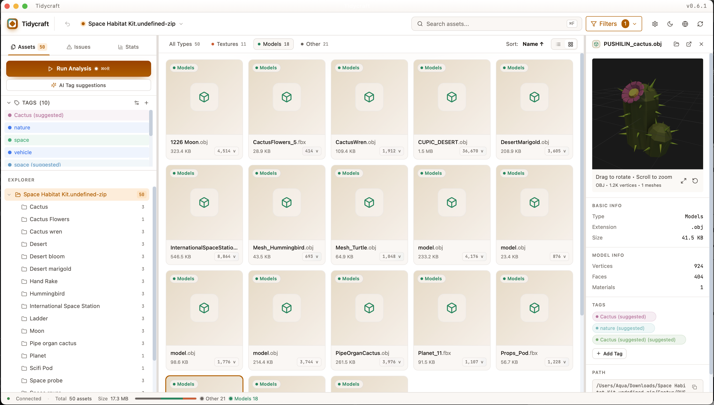
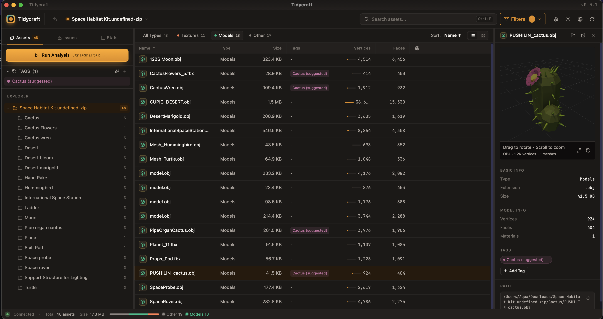

<div align="center">

# 🎮 Tidycraft

**Game Asset Management & Analysis Tool**

[](https://tauri.app/)
[](https://www.rust-lang.org/)
[](https://react.dev/)
[](LICENSE)

[English](README.md) | [简体中文](README.zh-CN.md)

*A cross-platform desktop application for scanning, browsing, and analyzing game project assets.*

</div>

---

## 📸 Screenshots

<div align="center">

**Grid view** — virtualized cards with on-demand thumbnails, 3D preview pane, and the AI-suggested tag applied to matching assets.



<br><br>

**List view** — type-filter pills, sort pill, resizable columns with a vertex-count mini bar, sticky header.



</div>

---

## ⚠️ Path & Naming Best Practices

> **Important:** For optimal compatibility with 3D model preview and asset loading, please follow these guidelines.

### ✅ Recommended

- Use **ASCII characters** for file and folder names
- Use **hyphens** `-` or **underscores** `_` instead of spaces
- Keep paths **short and simple**
- Place texture files in the **same directory** as the model file

**Good Examples:**
```
/Projects/my-game/models/character_model.fbx
/Projects/my-game/textures/diffuse_map.png
```

### ❌ Avoid

| Issue | Example | Problem |
|-------|---------|---------|
| Spaces in names | `floor color.png` | May fail to load |
| Special characters | `model[v2].fbx` | Breaks path parsing |
| Non-ASCII paths | `模型/character.fbx` | Encoding issues |
| Very long paths | `>200 characters` | System limitations |

### Why These Limitations?

Some 3D model formats (FBX, OBJ, DAE) embed texture paths internally. When these paths contain special characters, the Tauri asset protocol may not resolve them correctly. This is a known platform limitation.

---

## ✨ Features

### 🔍 Asset Scanning
- **Fast async scanning** with real-time progress and cancellation
- **Project type detection** — Unity, Unreal, Godot, or generic
- **Directory tree visualization** with file counts and sizes
- **Unity .meta file parsing** — extracts GUIDs for asset tracking

### 🏷️ Tag System
- Create custom **color-coded tags**
- Tag single or multiple assets at once
- **Filter assets by tags** (single or multi-select)
- Tags persist across sessions

### 📊 Metadata Extraction

| Asset Type | Extracted Info |
|------------|----------------|
| **Images** | Resolution, alpha channel, format |
| **3D Models** | Vertices, faces, materials |
| **Audio** | Duration, sample rate, channels, bit depth |

### 🖼️ Asset Browser
- **Thumbnail preview** with disk caching
- **Virtual scrolling** — handles 10,000+ files smoothly
- **Search** by filename or path
- **Filter** by asset type
- **3D model preview** with orbit controls

### 📋 Rule-Based Analysis

| Category | Checks |
|----------|--------|
| **Naming** | Forbidden chars, Chinese chars, prefix, case style |
| **Textures** | Power-of-two, max size |
| **Models** | Vertex/face/material limits |
| **Audio** | Sample rate, duration |
| **Duplicates** | SHA256-based detection |

---

## 📦 Supported Formats

| Category | Formats |
|----------|---------|
| **Textures** | PNG, JPG/JPEG, TGA, BMP, GIF |
| **3D Models** | glTF, GLB, FBX, OBJ (+MTL), DAE |
| **Audio** | WAV, MP3, OGG |
| **Other** | Scripts, Materials, Prefabs, Scenes |

---

## 🛠️ Tech Stack

| Layer | Technology |
|-------|------------|
| **Framework** | Tauri 2.0 |
| **Backend** | Rust |
| **Frontend** | React 18 + TypeScript |
| **Styling** | Tailwind CSS |
| **State** | Zustand |
| **3D Rendering** | Three.js |
| **Virtualization** | @tanstack/react-virtual |

### Rust Crates
`image` · `gltf` · `tobj` · `symphonia` · `sha2` · `walkdir` · `toml` · `git2` · `rayon`

---

## 🚀 Getting Started

### Prerequisites

- [Node.js](https://nodejs.org/) 18+
- [pnpm](https://pnpm.io/) 8+
- [Rust](https://rustup.rs/) 1.75+

### Installation

```bash
# Clone repository
git clone https://github.com/AquaStarfish/Tidycraft.git
cd tidycraft

# Install dependencies
pnpm install

# Run in development mode
pnpm tauri dev

# Build for production
pnpm tauri build
```

---

## 📖 Usage

1. **Open Project** — Click "Open Project" and select your game project folder
2. **Browse Assets** — Navigate the directory tree, search, and filter
3. **Preview Assets** — Click any asset to view details and preview
4. **Tag Assets** — Right-click to add tags for organization
5. **Run Analysis** — Click "Run Analysis" to check for issues
6. **Review Issues** — Switch to Issues tab to see problems

---

## ⚙️ Configuration

Drop a `tidycraft.toml` in your project root and the next analysis will pick it up automatically. The Sidebar's **Run Analysis** button shows a small dot when custom rules are loaded.

A working starter config is at [`examples/tidycraft.example.toml`](examples/tidycraft.example.toml) — copy it to your project root, rename to `tidycraft.toml`, and tweak. For per-rule explanations and tuning advice see [`docs/analyzer-rules.md`](docs/analyzer-rules.md). Quick reference:

```toml
[naming]
enabled = true
forbidden_chars = ['<', '>', ':', '"', '|', '?', '*', '/', '\']
forbid_chinese = true
max_length = 64
texture_prefix = "T_"      # nullable
model_prefix = "SM_"       # nullable
audio_prefix = "A_"        # nullable
case_style = "snake_case"  # any | snake_case | kebab-case | PascalCase | camelCase

[texture]
enabled = true
require_pot = true
max_size = 4096            # px
min_size = 4               # px
warn_non_square = false
max_file_size = 10_485_760 # bytes

[model]
enabled = true
max_vertices = 100_000
max_faces = 100_000
max_materials = 10

[audio]
enabled = true
allowed_sample_rates = [44_100, 48_000]
max_sfx_duration = 30.0    # seconds
max_file_size = 20_971_520 # bytes
prefer_mono_for_sfx = false
```

Any field can be omitted — missing fields fall back to defaults.

---

## 📁 Project Structure

```
tidycraft/
├── src/                    # React frontend
│   ├── components/         # UI components
│   ├── stores/             # Zustand state
│   ├── styles/             # Global CSS + Forge design tokens
│   ├── types/              # TypeScript types
│   ├── hooks/              # React hooks
│   ├── i18n/locales/       # en.json + zh.json
│   └── lib/                # Utilities
├── src-tauri/              # Rust backend
│   └── src/
│       ├── scanner.rs      # Asset scanning
│       ├── watcher.rs      # FS watcher → fs-change events
│       ├── analyzer/       # Rule engine
│       ├── thumbnail.rs    # Thumbnail generation
│       ├── tags.rs         # Tag management
│       └── lib.rs          # Tauri commands
└── REDESIGN.md             # Visual redesign phase tracker
```

---

## 🗺️ Roadmap

Shipped:

- [x] Dependency analysis & reference tracking (Unity GUID graph, unused-asset detection)
- [x] Statistics dashboard & reports
- [x] Git integration (branch info, per-file change status)
- [x] Incremental scanning (mtime/size cache)
- [x] Batch rename operations (with persistent undo)
- [x] Export reports (JSON, CSV, HTML)
- [x] Live filesystem watcher (auto-refresh on file changes)
- [x] Multi-project workspace + cross-session restore
- [x] Tag system with multi-select filtering
- [x] Safe delete / move / copy / duplicate (OS trash)

In progress:

- [ ] **Visual redesign** — Forge Dark theme migration (see `REDESIGN.md`).
  Phase 0 (tokens), 1 (visual refresh), 2 (ProjectSwitcher) shipped;
  Phase 3 (Command Palette ⌘K) in progress; Phase 4 (Gallery / grid view) and
  Phase 5 (AI tag suggestions) queued.

Backlog:

- [ ] Custom rule scripting (`tidycraft.toml` is parsed but not yet wired through the UI)

---

## 📄 License

[MIT](LICENSE)

---

<div align="center">

Made with ❤️ for game developers

</div>
