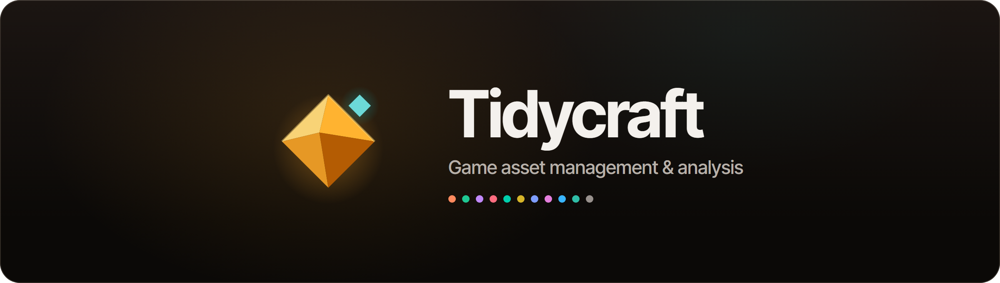
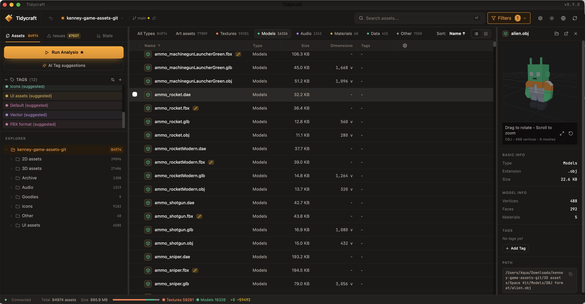
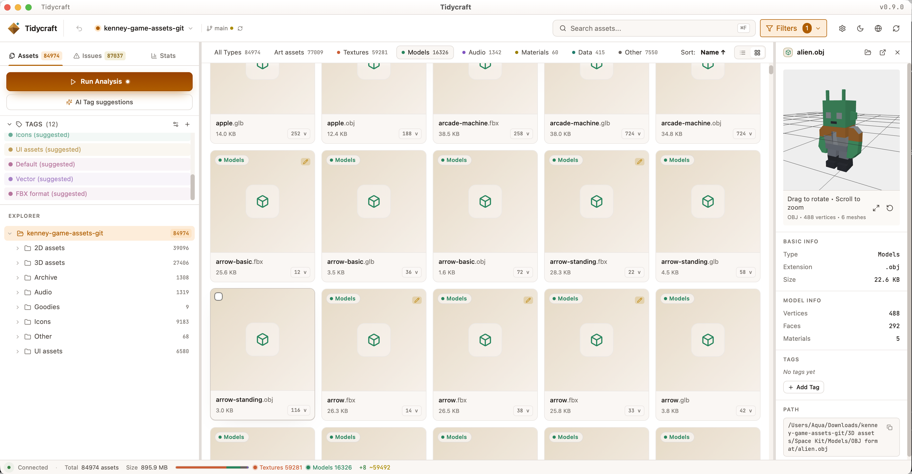

<div align="center">



[](LICENSE)
[](https://github.com/Lynthar/Tidycraft/actions/workflows/ci.yml)
[](https://github.com/Lynthar/Tidycraft/releases)
[](https://crates.io/crates/tidycraft)

</div>

Cross-engine game asset lint — scan Unity, Unreal, Godot or generic projects, in a desktop app or in CI

English | [简体中文](README.zh-CN.md)

Give it a game project directory and it traverses the asset tree, identifies
which engine the project belongs to, reads the metadata of every texture, model,
audio and video file, and checks all of it against the rules you configure. It's
the equivalent of ESLint for the files that don't get compiled.

One engine, two front ends: a desktop app for browsing, tagging, bulk renaming
and fixing things, and a headless `tidycraft` command for CI. Both read the same
`tidycraft.toml` and produce the same findings — what I wanted was the same
checks running in both places.



<sub>List view over a folder of asset packs — 84,974 assets, 895.9 MB. Type
filters, tags, and a 3D preview with vertex, face and material counts for the
selected model.</sub>



<sub>The same library in grid view, light theme.</sub>

## Install

**Desktop app** — from [Releases](https://github.com/Lynthar/Tidycraft/releases):

| Platform | Package |
|---|---|
| Windows | `Tidycraft_0.9.0_x64_en-US.msi` or the `_x64-setup.exe` NSIS installer |
| macOS | `Tidycraft_0.9.0_aarch64.dmg` for Apple Silicon, `_x64.dmg` for Intel |
| Linux | `Tidycraft_0.9.0_amd64.deb`, `Tidycraft-0.9.0-1.x86_64.rpm`, `Tidycraft_0.9.0_amd64.AppImage` |

The macOS builds are neither signed nor notarised, so Gatekeeper will complain
the first time:

```bash
xattr -d com.apple.quarantine /Applications/Tidycraft.app
```

**Command line** — from crates.io, or as a standalone binary:

```bash
cargo install tidycraft
```

```bash
curl -L -o tidycraft https://github.com/Lynthar/Tidycraft/releases/latest/download/tidycraft-cli-linux-x86_64
chmod +x tidycraft
```

The Windows installers and the Linux `.deb` / `.rpm` also put `tidycraft` on your
PATH. The `.dmg` and AppImage don't, so use the standalone binary in those cases.

Building from source needs Rust 1.88, Node 18+ and pnpm.

## Usage

```bash
tidycraft check .
```

```bash
tidycraft check . --fail-on warning     # error | warning | info
tidycraft check . --update-baseline     # record today's findings, commit the file
tidycraft rules                         # every rule id, and what this project set it to
tidycraft explain naming.prefix         # what one rule checks and how to tune it
tidycraft scan . --types texture,model  # asset inventory as JSON
```

`check` also takes `--format human|json|sarif|github`, `--config`, `--baseline`,
`--strict`, `--max-issues`, `--summary-only` and `--group-by`. There's a
composite GitHub Action in the repository root if you'd rather not write the
workflow yourself.

## Configuration

`tidycraft.toml` in the project root holds the rules. `tidycraft rules` prints
what's currently in effect, and `examples/tidycraft.example.toml` is a commented
example you can copy and edit.

Rule families cover textures (file size, power-of-two, size bounds, non-square,
mipmaps, colour space), naming (length, forbidden characters, CJK, prefixes,
case), models (vertices, faces, materials), audio (sample rate, SFX duration,
stereo SFX, file size), exact duplicates by SHA256, missing references, PBR
texture sets, and DCC source files. Sections are parsed strictly — a misspelled
key is an error, not something silently ignored.

Three more files appear in the project directory: `tidycraft.baseline.json`
(findings you've accepted), `.tidycraft-tags.json` (tags you've applied), and
`tidycraft.ai.toml` if you use the learning mode.

## Limitations

- **The three engines aren't supported to the same depth; Unity is deepest.**
  Missing-reference detection relies on Unity GUIDs; Unreal gets `.uproject`
  detection and extension-based classification but no `.uasset` dependency graph;
  Godot's `uid://` references are deliberately not matched.
- **The CLI is read-only except for one flag.** `check`, `rules`, `explain` and
  `scan` write nothing; only `check --update-baseline` writes the baseline file.
  That's what makes it safe to allow the whole `tidycraft` prefix in an agent's
  tool list.
- **A green run doesn't mean every rule ran.** Texture rules skip quietly when
  they can't read dimensions, so a checkout where git-lfs pointers were never
  fetched comes back clean. `--strict` turns "couldn't read" into a failure.
- **It doesn't do version control or team collaboration.** The git integration
  only reads and displays status; there's no file locking and no live sync.
- **No 3D thumbnails.** "Open in external editor" hands the file to your OS
  default; it isn't integrated with any particular tool.

## Documentation

- [Analyzer rules](docs/analyzer-rules.md) — every rule, what triggers it, what
  to set it to.
- [Contributing](CONTRIBUTING.md) — including how contributions are licensed.

## Security

AI tagging is an optional feature, off by default. When you turn it on, **your API
key is stored in the WebView's localStorage in plain text**: not encrypted, and
not in the system keychain. Apart from AI tagging, all analysis runs locally;
data only leaves the machine when that feature is enabled.

Desktop builds aren't code-signed or notarised.

## License

GNU Affero General Public License v3.0 only — see [LICENSE](LICENSE).
Copyright (c) 2026 Lynthar.

Contributions are accepted under the Apache License 2.0; see
[CONTRIBUTING.md](CONTRIBUTING.md). Releases up to and including v0.8.5 were
published under Apache 2.0 and remain available under it.
