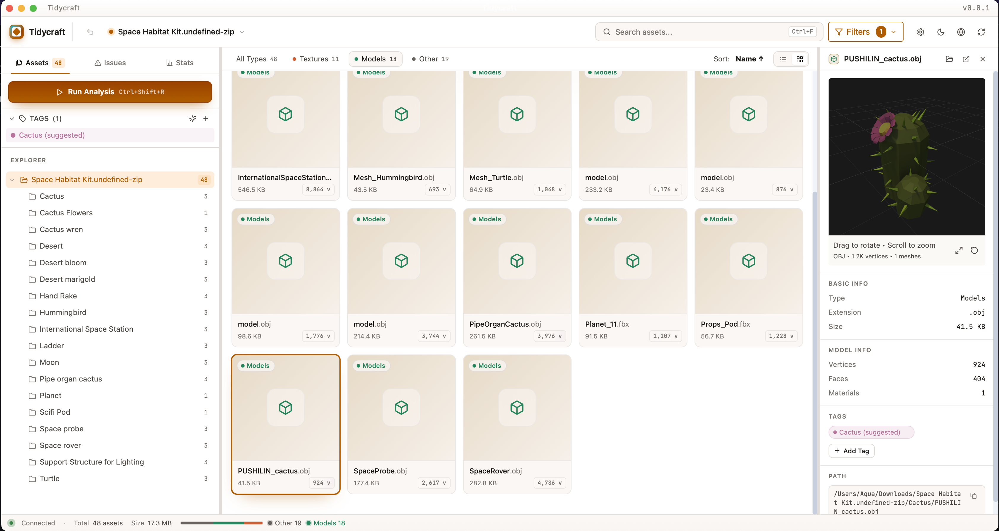

<div align="center">

# 🎮 Tidycraft

**游戏资源管理与分析工具**

[](https://tauri.app/)
[](https://www.rust-lang.org/)
[](https://react.dev/)
[](LICENSE)

[English](README.md) | [简体中文](README.zh-CN.md)

*一款跨平台桌面应用，用于扫描、浏览和分析游戏项目资源。*

</div>

---

## 📸 截图

<div align="center">

**网格视图** — 虚拟化卡片 + 按需缩略图，右侧 3D 预览面板，AI 推荐标签已应用到匹配资产上。



<br><br>

**列表视图** — 类型筛选 pill、排序 pill、可拖动调整的列宽 + 顶点数微型条形图，sticky 表头。


</div>

---

## ⚠️ 路径与命名最佳实践

> **重要提示：** 为确保 3D 模型预览和资源加载的兼容性，请遵循以下指南。

### ✅ 推荐做法

- 文件和文件夹名称使用 **ASCII 字符**
- 使用 **连字符** `-` 或 **下划线** `_` 代替空格
- 保持路径 **简短**
- 将纹理文件放在与模型文件 **相同的目录** 中

**正确示例：**
```
/Projects/my-game/models/character_model.fbx
/Projects/my-game/textures/diffuse_map.png
```

### ❌ 应避免

| 问题 | 示例 | 影响 |
|------|------|------|
| 名称包含空格 | `floor color.png` | 可能加载失败 |
| 特殊字符 | `model[v2].fbx` | 路径解析错误 |
| 非 ASCII 路径 | `模型/character.fbx` | 编码问题 |
| 路径过长 | `>200 字符` | 系统限制 |

### 为什么有这些限制？

某些 3D 模型格式（FBX、OBJ、DAE）会在内部嵌入纹理路径。当这些路径包含特殊字符时，Tauri 资源协议可能无法正确解析。这是平台的已知限制。

---

## ✨ 功能特性

### 🔍 资源扫描
- **快速异步扫描**，支持实时进度显示和取消
- **项目类型检测** — Unity、Unreal、Godot 或通用项目
- **目录树可视化**，显示文件数量和大小统计
- **Unity .meta 文件解析** — 提取 GUID 用于资源追踪

### 🏷️ 标签系统
- 创建自定义 **彩色标签**
- 支持单个或批量添加标签
- **按标签筛选资源**（单选或多选）
- 标签数据跨会话持久保存

### 📊 元数据提取

| 资源类型 | 提取信息 |
|----------|----------|
| **图片** | 分辨率、Alpha 通道、格式 |
| **3D 模型** | 顶点数、面数、材质数 |
| **音频** | 时长、采样率、声道数、位深度 |

### 🖼️ 资源浏览器
- **缩略图预览**，支持磁盘缓存
- **虚拟滚动** — 流畅处理 10,000+ 文件
- 按文件名或路径 **搜索**
- 按资源类型 **筛选**
- **3D 模型预览**，支持轨道控制

### 📋 规则分析

| 类别 | 检查项 |
|------|--------|
| **命名** | 禁用字符、中文字符、前缀、大小写风格 |
| **纹理** | 2 的幂次方、最大尺寸 |
| **模型** | 顶点/面/材质数量限制 |
| **音频** | 采样率、时长 |
| **重复文件** | 基于 SHA256 检测 |

---

## 📦 支持的格式

| 类别 | 格式 |
|------|------|
| **纹理** | PNG, JPG/JPEG, TGA, BMP, GIF |
| **3D 模型** | glTF, GLB, FBX, OBJ (+MTL), DAE |
| **音频** | WAV, MP3, OGG |
| **其他** | 脚本、材质、预制体、场景 |

---

## 🛠️ 技术栈

| 层级 | 技术 |
|------|------|
| **框架** | Tauri 2.0 |
| **后端** | Rust |
| **前端** | React 18 + TypeScript |
| **样式** | Tailwind CSS |
| **状态管理** | Zustand |
| **3D 渲染** | Three.js |
| **虚拟化** | @tanstack/react-virtual |

### Rust 依赖
`image` · `gltf` · `tobj` · `symphonia` · `sha2` · `walkdir` · `toml` · `git2` · `rayon`

---

## 🚀 快速开始

### 环境要求

- [Node.js](https://nodejs.org/) 18+
- [pnpm](https://pnpm.io/) 8+
- [Rust](https://rustup.rs/) 1.75+

### 安装步骤

```bash
# 克隆仓库
git clone https://github.com/AquaStarfish/Tidycraft.git
cd tidycraft

# 安装依赖
pnpm install

# 开发模式运行
pnpm tauri dev

# 构建生产版本
pnpm tauri build
```

---

## 📖 使用方法

1. **打开项目** — 点击"打开项目"并选择游戏项目文件夹
2. **浏览资源** — 导航目录树、搜索和筛选
3. **预览资源** — 点击任意资源查看详情和预览
4. **标记资源** — 右键点击添加标签进行分类
5. **运行分析** — 点击"运行分析"检查问题
6. **查看问题** — 切换到问题选项卡查看检测结果

---

## ⚙️ 配置说明

把 `tidycraft.toml` 放到项目根目录，下次 Run Analysis 会自动加载。侧边栏的 **运行分析** 按钮上会出现一个小圆点提示当前使用了自定义规则。

可用的样例文件：[`examples/tidycraft.example.toml`](examples/tidycraft.example.toml) —— 复制到你的项目根目录、改名为 `tidycraft.toml`，按需调整即可。字段速查：

```toml
[naming]
enabled = true
forbidden_chars = ['<', '>', ':', '"', '|', '?', '*', '/', '\']
forbid_chinese = true
max_length = 64
texture_prefix = "T_"      # 可选
model_prefix = "SM_"       # 可选
audio_prefix = "A_"        # 可选
case_style = "snake_case"  # any | snake_case | kebab-case | PascalCase | camelCase

[texture]
enabled = true
require_pot = true
max_size = 4096            # 像素
min_size = 4               # 像素
warn_non_square = false
max_file_size = 10_485_760 # 字节

[model]
enabled = true
max_vertices = 100_000
max_faces = 100_000
max_materials = 10

[audio]
enabled = true
allowed_sample_rates = [44_100, 48_000]
max_sfx_duration = 30.0    # 秒
max_file_size = 20_971_520 # 字节
prefer_mono_for_sfx = false
```

任何字段都可省略，缺失的字段会回退到默认值。

---

## 📁 项目结构

```
tidycraft/
├── src/                    # React 前端
│   ├── components/         # UI 组件
│   ├── stores/             # Zustand 状态
│   ├── styles/             # 全局 CSS + Forge 设计 token
│   ├── types/              # TypeScript 类型
│   ├── hooks/              # React hooks
│   ├── i18n/locales/       # en.json + zh.json
│   └── lib/                # 工具函数
├── src-tauri/              # Rust 后端
│   └── src/
│       ├── scanner.rs      # 资源扫描
│       ├── watcher.rs      # 文件系统 watcher → fs-change 事件
│       ├── analyzer/       # 规则引擎
│       ├── thumbnail.rs    # 缩略图生成
│       ├── tags.rs         # 标签管理
│       └── lib.rs          # Tauri 命令
└── REDESIGN.md             # 视觉重设计阶段进度
```

---

## 🗺️ 路线图

已发布：

- [x] 依赖分析与引用追踪（Unity GUID 图、未引用资源检测）
- [x] 统计仪表板与报告
- [x] Git 集成（分支信息、单文件变更状态）
- [x] 增量扫描（基于 mtime/size 缓存）
- [x] 批量重命名操作（持久化撤销）
- [x] 导出报告（JSON、CSV、HTML）
- [x] 文件系统实时 watcher（外部修改自动刷新）
- [x] 多项目工作区 + 跨会话恢复
- [x] 标签系统（支持多选筛选）
- [x] 安全删除 / 移动 / 复制 / 副本（系统回收站）

进行中：

- [ ] **视觉重设计** — Forge Dark 主题迁移（见 `REDESIGN.md`）。
  Phase 0（tokens）、Phase 1（视觉换肤）、Phase 2（ProjectSwitcher）已完成；
  Phase 3（Command Palette ⌘K）进行中；
  Phase 4（Gallery / grid 视图）与 Phase 5（AI 标签建议）排队中。

待办：

- [ ] 自定义规则脚本（`tidycraft.toml` 已解析但 UI 尚未接入）

---

## 📄 许可证

[MIT](LICENSE)

---

<div align="center">

为游戏开发者用心打造 ❤️

</div>
